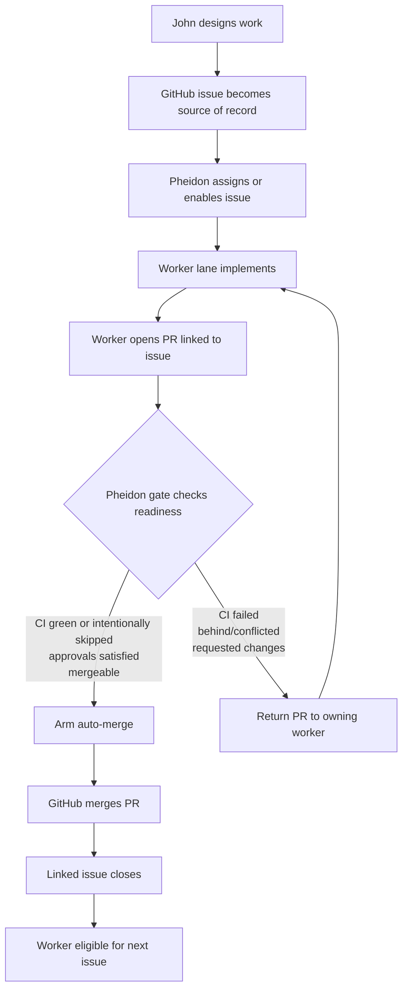
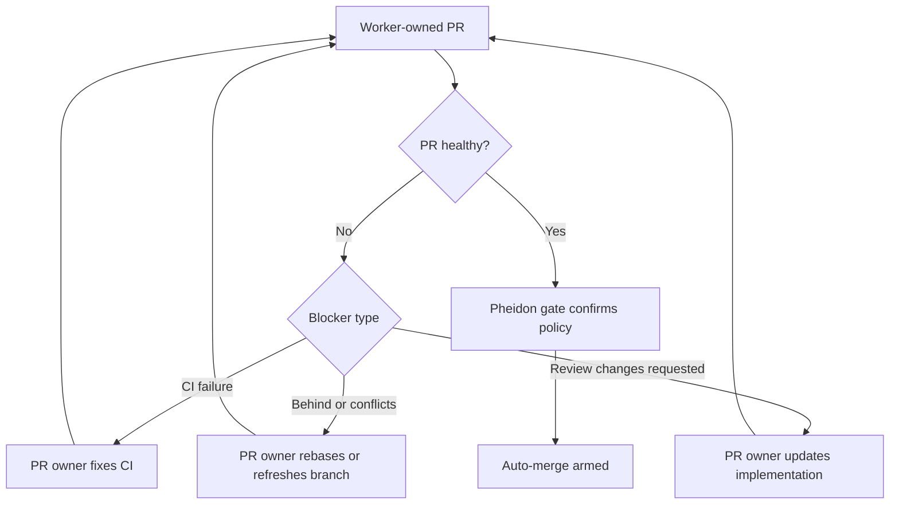

# Bootstrap

Manifest-first control plane for repo scaffolding, GitHub governance, and portable agent profiles.

Use `project.bootstrap.yaml` as the control plane for repo-local scaffolding, GitHub governance, CI policy, and portable Codex/Claude profile sync. Plan first, then apply repo, GitHub, and home targets deliberately.

## What The Bootstrap Owns

- GitHub governance, environments, and optional org defaults
- Repo-local `AGENTS.md`, `CLAUDE.md`, `CONTRIBUTING.md`, and pull request template guidance
- Fast PR checks plus heavier extended validation lanes
- Portable Codex and Claude home profile sync
- Operator docs for onboarding, hosted agents, and follow-up setup

## Quickstart

```sh
bootstrap plan --manifest ./project.bootstrap.yaml
bootstrap apply repo --manifest ./project.bootstrap.yaml
bootstrap apply github --manifest ./project.bootstrap.yaml
bootstrap apply home --manifest ./project.bootstrap.yaml
bootstrap doctor --manifest ./project.bootstrap.yaml
```

If `github.organization` is set and `OMT-Global` is an organization, `bootstrap apply github` also reconciles org defaults for new repos.

Confirm branch protection points at the `CI Gate` status.

## Contributor And PR Guidance

- `CONTRIBUTING.md` is the canonical contributor onboarding and local validation surface.
- `.github/PULL_REQUEST_TEMPLATE.md` is the canonical pull request format for summaries, governing issue links, validation notes, and merge-readiness checks.
- Existing bootstrapped repos can retrofit these surfaces with `bootstrap apply repo --manifest ./project.bootstrap.yaml`; repos with restricted `repo.managedPaths` should include both paths before applying.

## Project Identity

- Product name: `Bootstrap`
- Repository: `OMT-Global/bootstrap`
- Manifest: `project.bootstrap.yaml`
- Visibility: `public`
- Default branch: `main`
- Archetype: `generic-empty`

## Claude Code

This bootstrap can prepare these Claude workflows:

- First-party Claude Code on the web via `claude.ai/code` and `bash scripts/claude-cloud/setup.sh`
- Interactive containerized work via `.devcontainer/devcontainer.json` and `bash scripts/claude/setup-devcontainer.sh`
- Remote GitHub-hosted automation via `.github/workflows/claude.yml`

The full checklist is in `docs/bootstrap/claude-environment.md`.

## Kingdom Governance Flow

### Issue to merge flow



### PR ownership and repair loop



### Governance rules

- GitHub issues are the source of record for agent execution work.
- Pheidon is the orchestrator and current gate.
- Workers should act from assigned or explicitly enabled issues.
- PR authors may not approve their own PRs.
- PR owners must repair their own PRs until merge-ready unless Pheidon explicitly reassigns ownership.
- Healthy PRs should converge toward auto-merge.

## Repository URL

- https://github.com/OMT-Global/bootstrap
