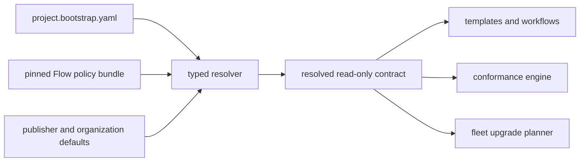

# ADR-0001: Resolve pinned Flow policy through project.bootstrap.yaml

- Status: Proposed
- Date: 2026-07-11
- Decision owners: Bootstrap maintainers
- Material notification: [Bootstrap issue #54](https://github.com/OMT-Global/bootstrap/issues/54) and the discovery pull request

## Context

Bootstrap already parses `project.bootstrap.yaml`, supplies defaults, renders managed files and workflows, records managed-file hashes, plans drift, reconciles fleets, and provisions GitHub settings. Its current manifest v2 is an incremental extension of v1, not the Public Repository Standard v1 contract. Several required concerns are absent, while some current defaults conflict with the target standard.

Creating a second editable policy file would split repository authority. Copying Flow policy into Bootstrap would allow semantic drift.

## Decision

`project.bootstrap.yaml` remains the sole editable repository control-plane input. Bootstrap will resolve it against an immutable Flow policy bundle into a read-only internal contract used by renderers and validators.

The resolver will:

1. Require compatible, immutable Flow and Bootstrap versions for strict public-repository conformance.
2. Apply publisher/org defaults without hard-coding a publisher name or physical provenance sink.
3. Support explicit migration from existing v1 and current v2 manifests; no implicit destructive rewrite is allowed.
4. Preserve unknown or unsupported settings during migration and report them with remediation.
5. Validate exceptions, including scope, issue, rationale, and approval; temporary exceptions normally require expiry, while permanent exceptions require an ADR and explicit human approval.
6. Produce deterministic output suitable for human and JSON conformance reports.

## Consequences

- The current v2 schema needs a compatibility layer before it can adopt the standard's v2 shape.
- Rendering must consume the resolved contract instead of ad hoc manifest defaults.
- Existing consumers referencing reusable workflows on `main` must migrate to exact releases or immutable SHAs.
- Generated artifacts need ownership markers and drift protection, which will intentionally change many snapshots.
- Private provenance sink credentials remain environment/organization configuration, never repository YAML or generated public files.

## Alternatives considered

### Add another repository policy file

Rejected because it creates two editable contracts and ambiguous precedence.

### Vendor Flow policy into Bootstrap source

Rejected because it permits semantic drift and obscures which released policy a repository follows.

### Replace current v2 in place without migration

Rejected because existing manifests already use v2 with incompatible field meanings and repository classes.

## Rollout

1. Freeze and document current v1/v2 behavior with characterization tests.
2. Add the pinned policy loader and resolved-contract types behind a non-enforcing mode.
3. Add an explicit migration command and fixture corpus.
4. Move renderers and validators to the resolved contract by capability.
5. Dogfood in `plan` mode on Bootstrap and Flow before applying changes.
6. Enable strict conformance only after the first representative repository per class passes.

Implementation is tracked by [Bootstrap issues #54-#64](https://github.com/OMT-Global/bootstrap/issues?q=is%3Aissue%20state%3Aopen%20number%3A54-64).

## Security and privacy

Policy bundles and public resolved metadata must contain no credentials. Logical sink configuration may identify a provider and sink key, but credentials and physical storage details come from short-lived runtime identity. Provenance redaction fails closed for material changes when full provenance is required.

## Revisit conditions

Revisit if deterministic offline resolution cannot be supported, if Flow policy compatibility cannot be expressed without network access, or before adding another editable repository contract.
