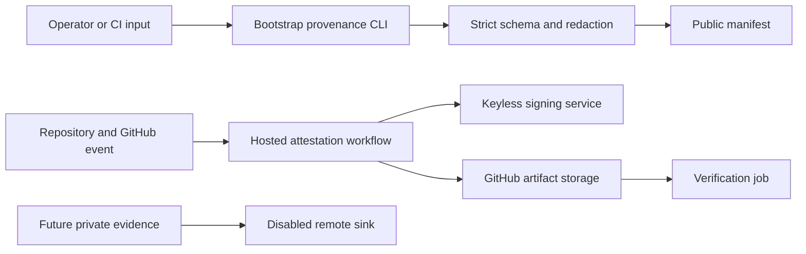

# Bootstrap provenance threat model

## Executive summary

Bootstrap is a local TypeScript control-plane CLI plus GitHub Actions workflow set. For provenance, the highest risks are publishing sensitive input through a public manifest, accepting forged reviewer or subject lineage, trusting an unsigned or improperly verified manifest, and later allowing private-bundle or sink failures to fail open. The current local public contract reduces disclosure risk with strict schema allowlists and typed redaction, while signed public lineage, encrypted private bundles, remote sinks, audited reads, retention, and material-merge enforcement remain explicit follow-up controls rather than assumed protections.

## Scope and assumptions

- In scope: `src/provenance.ts`, provenance commands in `src/cli.ts`, the shared filter use in `src/notifications.ts`, `.github/workflows/ai-attestation-reusable.yml`, its renderer in `src/archetypes.ts`, and their tests and operator documentation.
- Runtime scope is the local CLI and generated files. CI scope is the GitHub-hosted attestation workflow and artifact handoff. These are separate provenance formats today.
- Public provenance is limited to schema-allowlisted metadata. Private model/tool evidence may be sensitive, but literal credentials are prohibited from both public and future private output.
- A future remote sink must use short-lived OIDC identity with separate write and read roles. Production sink use is disabled until independent security review and explicit human approval.
- Out of scope for this slice: selecting a storage provider, physical bucket names, production spending, retention exceptions, private-data exposure approval, and implementation of encryption or audited remote reads.
- Open questions for later slices: the authoritative source for reviewer lineage; the production sink provider and jurisdiction; retention/Object Lock duration; and the exact material-change capture gate. These choices materially affect integrity, confidentiality, and availability rankings.

## System model

### Primary components

- The `bootstrap provenance create` and `validate` commands read operator-selected JSON files, invoke the Zod contract, and write or print public JSON (`src/cli.ts`, `src/provenance.ts`).
- The version-2 public contract validates subject, execution, reviewer, allowlisted metadata, and redaction evidence. Default validation is v2-only; an explicit strict reader retains version 1 for historical readability, but legacy manifests do not satisfy the current allowlist policy. Neither format fetches GitHub reviewer state or signs output (`src/provenance.ts`).
- The reusable AI attestation workflow constructs a separate commit-scoped JSON blob, signs it keylessly with cosign using GitHub OIDC, uploads it, then verifies the downloaded artifact (`.github/workflows/ai-attestation-reusable.yml`).
- The renderer projects attestation callers and workflow configuration into managed repositories (`src/archetypes.ts`, `src/manifest.ts`).
- Material-action notifications reuse the credential detector before sending governed messages to GitHub or configured webhooks (`src/notifications.ts`, `src/github/client.ts`).
- Private encryption, remote sink writes, read auditing, retention enforcement, and merge-blocking capture are not implemented.

### Data flows and trust boundaries

- Operator JSON -> Bootstrap CLI: repository, commit, workflow, reviewer, and allowlisted metadata cross a local file boundary. The CLI parses JSON and applies strict Zod validation; there is no authentication because the operator controls the local process (`src/cli.ts`, `src/provenance.ts`).
- Bootstrap CLI -> public manifest file/stdout: validated JSON crosses into a publishable local artifact. Credential-shaped allowlisted values are replaced, unknown keys fail, and redaction evidence is checked; the file is not signed by this path (`src/provenance.ts`).
- Repository/GitHub event -> hosted workflow: checked-out repository state and workflow inputs enter a GitHub-hosted runner. Workflow permissions are `contents: read` and `id-token: write`; action dependencies are immutable pins on current main (`.github/workflows/ai-attestation-reusable.yml`).
- Hosted workflow -> Sigstore: cosign exchanges GitHub OIDC identity for keyless signing material over the network. Verification constrains the OIDC issuer and repository workflow identity (`.github/workflows/ai-attestation-reusable.yml`).
- Hosted workflow -> GitHub artifact storage -> verification job: JSON and cosign bundle cross an external artifact-storage boundary. The verification job downloads and verifies them before success (`.github/workflows/ai-attestation-reusable.yml`).
- Bootstrap notification plan -> GitHub/webhook: governed summaries cross an authenticated API or HTTPS boundary. Credential filtering, GitHub target parsing, and webhook destination controls are implemented separately from provenance (`src/notifications.ts`, `src/github/client.ts`).
- Future private bundle -> encrypted logical sink: sensitive evidence would cross into remote storage using short-lived identity. This boundary is unimplemented and prohibited from production use in the current scope.

#### Diagram

## Assets and security objectives

| Asset | Why it matters | Security objective (C/I/A) |
|---|---|---|
| Credentials and identity tokens | Exposure permits repository, cloud, or signing impersonation | C, I |
| Private model, prompt, tool, and customer evidence | May contain proprietary or personal information | C |
| Public provenance manifest | Consumers rely on subject, execution, and reviewer lineage | I, A |
| Cosign bundle and OIDC identity | Establish who signed which commit-scoped evidence | I |
| Reviewer lineage | Drives material-change governance and auditability | I |
| Workflow and immutable action pins | Compromise can forge or leak all downstream evidence | I, C, A |
| Artifact and future sink retention | Evidence must remain available without unauthorized mutation or reads | I, A, C |
| Audit records | Needed to detect improper capture, access, deletion, or verification | I, A |

## Attacker model

### Capabilities

- A pull-request author can control repository content and some workflow-visible metadata, but should not receive protected repository secrets.
- A malicious or mistaken operator can supply arbitrary JSON to the local provenance CLI and choose input/output paths.
- A compromised dependency or workflow revision can execute in CI with that job's granted permissions.
- An attacker who compromises future sink write credentials may attempt overwrite, deletion, or ciphertext substitution; a read-role compromise may expose private evidence.

### Non-capabilities

- A normal pull-request author cannot mint the repository's GitHub OIDC identity outside an authorized workflow.
- The local CLI is not a network service and exposes no listener or multi-tenant request surface.
- No production private sink, encryption-key service, or audited read path exists in current code; threats to those are design requirements, not claims of present exposure.
- Physical storage administration and organization-owner compromise are outside this repository-level model.

## Entry points and attack surfaces

| Surface | How reached | Trust boundary | Notes | Evidence (repo path / symbol) |
|---|---|---|---|---|
| Provenance input JSON | `bootstrap provenance create --input` | Local file -> CLI | Arbitrary JSON; strict parsing must fail closed | `src/cli.ts`, `createPublicProvenance` |
| Public manifest validation | `bootstrap provenance validate --input` | Local file -> validator | Hand-authored manifests must not bypass redaction evidence | `src/cli.ts`, `validatePublicProvenance` |
| Public output path | `--output` | CLI -> local filesystem | Operator-controlled path; command is intentionally mutating | `src/cli.ts` provenance command |
| Workflow inputs | Reusable workflow caller | Repository/workflow caller -> hosted runner | Provider, model, prompt hash, artifact name, and retention enter shell/YAML contexts | `.github/workflows/ai-attestation-reusable.yml` |
| GitHub OIDC | `cosign sign-blob` | Hosted runner -> Sigstore | Short-lived identity; repository workflow identity is verified | `.github/workflows/ai-attestation-reusable.yml` |
| Artifact upload/download | GitHub Actions artifact service | Runner -> external storage -> verifier | Integrity depends on signature verification and correct subject binding | `.github/workflows/ai-attestation-reusable.yml` |
| Notification destinations | Material-action delivery | CLI -> GitHub API/webhook | Shares secret detection but is a separate public-output surface | `src/notifications.ts`, `src/github/client.ts` |
| Generated workflows | Bootstrap renderer/apply | Manifest -> managed repository files | Unsafe projection could replicate a provenance weakness fleet-wide | `src/archetypes.ts`, `src/render.ts` |

## Top abuse paths

1. Sensitive-data disclosure: attacker or operator places private text in a generic metadata field -> generator copies it -> public artifact is uploaded -> private material becomes durable and searchable.
2. Secret leakage outside metadata: credential is placed in workflow/ref/reviewer identity -> validation scans only metadata -> public manifest publishes the credential.
3. Reviewer spoofing: caller supplies an `approved` reviewer object -> local schema validates shape without querying GitHub -> downstream policy mistakes user input for authenticated approval.
4. Subject substitution: a valid manifest is generated for one commit -> filename or surrounding workflow labels it as another -> consumer verifies format but not a signature bound to the expected subject.
5. Workflow supply-chain compromise: mutable or compromised action executes with OIDC permission -> attacker signs false evidence or exfiltrates workflow data -> verification trusts the authorized workflow identity.
6. Artifact replacement or verification confusion: attacker substitutes JSON/bundle pairs or exploits broad certificate identity matching -> verification succeeds for unintended workflow evidence.
7. Capture fail-open: provenance generation, signing, encryption, or sink write fails -> merge gate treats absence as optional -> material change lands without required evidence.
8. Future private-sink compromise: write role overwrites or deletes ciphertext, or read role is overbroad -> evidence integrity/availability or confidentiality is lost without an audit signal.

## Threat model table

| Threat ID | Threat source | Prerequisites | Threat action | Impact | Impacted assets | Existing controls (evidence) | Gaps | Recommended mitigations | Detection ideas | Likelihood | Impact severity | Priority |
|---|---|---|---|---|---|---|---|---|---|---|---|---|
| TM-001 | Malicious input or operator error | Sensitive content reaches public generation | Smuggle secrets or private text through permitted fields | Public disclosure and credential compromise | Credentials, private evidence | Credential patterns and typed placeholders (`src/provenance.ts`) | Pattern matching cannot classify arbitrary private data | Strict metadata key allowlist; bounds and strict objects; prohibit logs/prompts/tool output; adversarial fixtures | Alert on redaction count; scan generated public artifacts before upload | Medium | High | High |
| TM-002 | Malicious input | Attacker controls non-metadata identity fields | Place credential-like text in ref, workflow, URL, or lineage | Secret appears in public output | Credentials, public manifest | Strong SHA/run-id formats (`src/provenance.ts`) | Previous scanning covered metadata only | Apply credential rejection and length bounds to every free-text public field | Negative fixtures for each field; artifact secret scan | Medium | High | High |
| TM-003 | PR author or compromised caller | Reviewer data is supplied by caller | Claim an approval that GitHub never authenticated | Material changes appear independently reviewed | Reviewer lineage, public manifest | Reviewer state is typed (`src/provenance.ts`) | No GitHub review retrieval or head-SHA binding | Resolve reviews through least-privilege GitHub API; bind reviewer, state, submitted SHA, and author separation | Compare manifest lineage with GitHub API during verification | High | High | High |
| TM-004 | Artifact or local-file attacker | Consumer accepts unsigned public CLI output | Modify subject, execution, or lineage after generation | Forged provenance accepted | Public manifest | Separate AI workflow signs a commit-scoped blob (`.github/workflows/ai-attestation-reusable.yml`) | CLI public schema and signed AI blob are not unified | Canonical serialization; sign public manifest; verify exact repository, workflow, ref, and commit expectations | Record verification failures and signer identity | Medium | High | High |
| TM-005 | Dependency or workflow attacker | CI dependency or workflow permissions are compromised | Mint authorized-looking false evidence or leak inputs | Fleet-wide integrity or confidentiality loss | Workflow, OIDC identity, evidence | Immutable action pins and narrow permissions (`.github/workflows/ai-attestation-reusable.yml`) | Certificate identity regex is broad; workflow source lineage is not embedded in public schema | Pin all dependencies; restrict certificate identity to exact workflow/ref; include workflow digest and reusable-workflow SHA | Monitor pin drift and unexpected signer identities | Low | High | High |
| TM-006 | Infrastructure failure or policy bypass | Capture/sign/encrypt/store step fails | Treat missing provenance as non-blocking | Material merge lacks required audit evidence | Evidence availability, governance | `provenance-capture-failure` is a material action (`src/notifications.ts`) | No required merge gate consumes end-to-end capture result | Add fail-closed required check for material changes with explicit non-material classification | Alert on absent/failed capture and bypass attempts | Medium | High | High |
| TM-007 | Future sink writer/read-role attacker | Remote sink is enabled with excessive privileges | Read private bundles or overwrite/delete evidence | Disclosure or loss of audit integrity | Private evidence, retention, audit records | Confirmed design requires OIDC and role separation | Adapter, encryption, Object Lock, and audited reads do not exist | Envelope encryption; separate read/write roles; immutable retention; deny listing where possible; audited break-glass reads | Cloud audit logs, write-once checks, unexpected read alerts | Low until enabled | High | Medium |
| TM-008 | Operator or local attacker | CLI runs with filesystem privileges | Choose an unintended output path and overwrite a file | Local integrity loss | Local repository files | Explicit required `--output`; normal OS permissions (`src/cli.ts`) | No confinement to `provenance/runs` | Add optional safe-root enforcement for CI use; retain explicit override only for interactive operator use | Log resolved output path; CI assertion on destination | Low | Medium | Low |

## Criticality calibration

- Critical: a broadly exploitable path to organization credentials or private evidence across many repositories; forged signed provenance that directly authorizes releases; compromise of production encryption keys plus immutable evidence. None is established in current local-only scope.
- High: public leakage of a credential/private payload; authenticated reviewer or subject forgery that permits a material merge; workflow/OIDC compromise that signs false evidence.
- Medium: future sink availability loss with recovery, narrow exposure requiring a privileged role, or capture outage that blocks work but does not fail open.
- Low: operator-only local overwrite with normal filesystem access, malformed input rejected before output, or noisy availability impact limited to a rerunnable local command.

## Focus paths for security review

| Path | Why it matters | Related Threat IDs |
|---|---|---|
| `src/provenance.ts` | Defines the public schema, allowlist, redaction, and validation evidence | TM-001, TM-002, TM-003, TM-004 |
| `tests/provenance.test.ts` | Holds adversarial fixtures that prevent fail-open regression | TM-001, TM-002, TM-004 |
| `src/cli.ts` | Parses untrusted local JSON and writes operator-selected paths | TM-001, TM-008 |
| `.github/workflows/ai-attestation-reusable.yml` | Holds OIDC, cosign, artifact, and verification boundaries | TM-004, TM-005, TM-006 |
| `.github/workflows/ai-attestation.yml` | Defines the repository caller and permissions | TM-005, TM-006 |
| `src/archetypes.ts` | Replicates workflow behavior into downstream repositories | TM-005, TM-006 |
| `src/manifest.ts` | Accepts workflow identity, provider/model, artifact, and retention configuration | TM-001, TM-005 |
| `src/notifications.ts` | Shares secret filtering and represents capture failure as a material action | TM-001, TM-006 |
| `src/github/client.ts` | Likely integration point for authenticated reviewer-lineage resolution | TM-003 |
| `scripts/ci/check-pr-governance.sh` | Current authenticated reviewer and material-change gate logic | TM-003, TM-006 |
| `scripts/ci/check-action-pins.sh` | Enforces workflow supply-chain immutability | TM-005 |
| `src/render.ts` | Applies generated provenance workflow changes across managed repositories | TM-005, TM-006 |

Quality check: local CLI and CI entry points are separated; every identified trust boundary appears in at least one threat; current and future controls are distinguished; the confirmed privacy, OIDC, role-separation, review, and production-sink assumptions are reflected; unresolved provider, retention, reviewer-source, and merge-gate decisions remain explicit.
